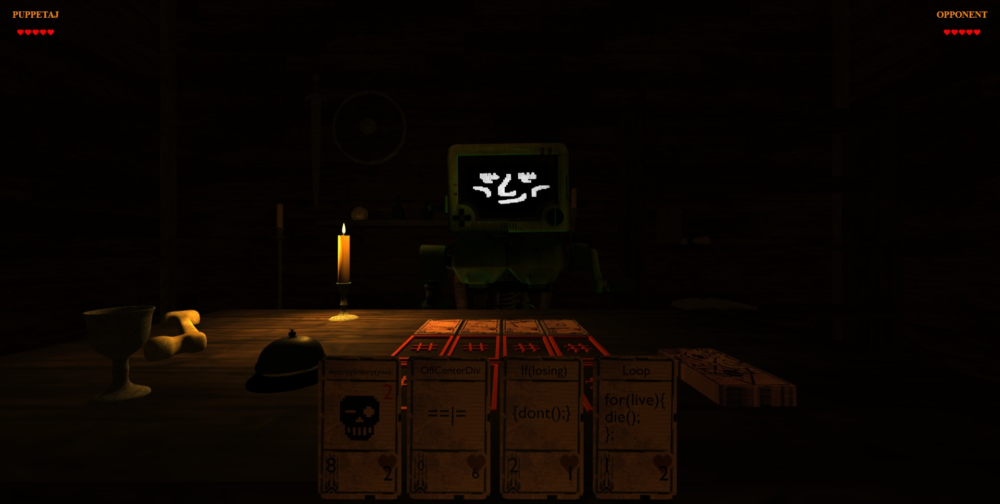

# Project 2: Grim Repo

## Description

This is Adrian Jimenez, Kenan McKenzie, and Johan Herrera's Project 2 submission. 

For out project, we decided to create a card game based off of the horror game Inscryption. In order to achieve this we learning how to incorporate 3D models onto our page using three.js and animating them using GSAP. We set up a database to store the data for the cards, and data for our players so that we could later have a leaderboard. Once our database was ready, we were able to create login routes and authentication for our users to be able to play the game. After being able to authenticate users, we created custom made cards, and were able to construct the game visuals and game logic to allow for a truly interactive user experience. Once the game has ended, our database is called to store the highscore of the player, and when the user is on the leaderboards page, then we display all scores from top to bottom.

## Table of Contents

- [Installation](#installation)
- [Languages](#languages)
- [Usage](#usage)
- [Credits](#credits)
- [License](#license)
- [Contributing](#contributing)
- [Questions](#questions)

## Installation

In order to install this project, download all files and have node.js installed on your machine. Navigate to the directory in which server.js is stored in and type: 

    npm install

Once all dependencies have been downloaded, you can excecute server.js by typing npm start

## Technologies Used

* JavaScript
* Node.JS
* MySQL
* dotenv
* mysql2
* sequelize
* express.js
* express-handlebars
* express-session
* connect-session-sequelize
* HTML
* CSS
* THREE.js
* GSAP

## Usage

In order to use this project, please create a .env file with the appropriate variables and set up the database using the schema.sql file in the db directory. Once that is set up, simply execute npm start and the application should start.

If you wish to seed the database, run "npm run seed"

Alternatively, visit the site here: 

All test account logins use the password "testpassword"

## Credits

* Adrian Jimenez
* Kenan McKenzie
* Johan Herrera
* (Model and code credits provided in main.js)

## License

This project is licensed under the MIT License. See [LICENSE.md](./LICENSE.md) for more details.

---

## Contributing

This project follows the contributor covenant contribution guidelines. See [here](https://www.contributor-covenant.org/version/2/1/code_of_conduct/) 

## Questions

If you have any questions or concerns visit my [github](https://github.com/PuppetAJ) or send me an email at <adrianjimenez1950@gmail.com>. 

